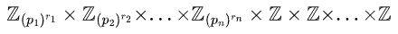

# Visualization of Theorems & Corollaries from an Abstract Algebra course

We created a graph of theorem and corollaries in Fraleigh's "A First Course in Abstract Algebra" with directed edges from theorems/corollaries to the previous theorems/corollarie/examples they reference.

That is, a node with a high *out-degree* indicates a theorem/corollary that references many other theorems/corollaries and a node with a high *in-degree* indicates a theorem/corollary that is highly referenced by other theorems.

The node with the highest *out-degree* is 
> ***Theorem 30.23*** Let $E$ be an extension field of $F$, and let $\alpha \in E$ be algebraic over $F$. If $\text{deg}(\alpha, F) = n$, then $F(\alpha)$ is an $n$-dimensional vector space over $F$ with basis ${1, \alpha, ..., \alpha_{n-1}}$. Furthermore, every element $\beta$ of $F(\alpha)$ is algebraic over $F$, and $\text{deg}(\alpha, F) \le \text{deg}(\alpha, F)$.

The node with the highest *in-degree* is
> ***Theorem 11.12* (Fundamental Theorem of Finitely Generated Abelian Groups)** Every finitely generated abelian group $G$ is isomorphic to a direct product of cyclic groups in the form 
> 
,

>
> where the $p_i$ are primes, not necessarily distinct, and the $r_i$ are positive integers. The direct product is unique except for possible rearrangement of the factors; that is, the number (*Betti number* of G) of factors $\mathbb{Z}$ is unique and the prime powers ${p_i}^{r_i}$ are unique.

<!-- $$\mathbb{Z}_{(p_1)^{r_1}} \times \mathbb{Z}_{(p_2)^{r_2}} \times ... \times \mathbb{Z}_{(p_n)^{r_n}} \times \mathbb{Z} \times \mathbb{Z} \times ... \times \mathbb{Z}$$ -->

## Part-aggregated and Chapter-aggregated Graphs

Since we have 713 nodes and 581 edges, plotting the graph as it stands proves difficult. To make visualization easier, we have aggregated nodes (theorems/corollaries) by their respective chapters and units (for instance, *Theorem 30.23* is in Part VII, Chapter 30).

    
    

The chapters with the most number of connections are as follows:

| Chapter Number | Chapter Name            | Chapter Number | Chapter Name                   | Weight |
|----------------|-------------------------|----------------|--------------------------------|--------|
| 36             | Sylow Theorems          | 37             | Applications of Sylow Theorems | 8      |
| 14             | Factor Groups           | 26             | Homomorphisms and Factor Rings | 7      |
| 30             | Vector Spaces           | 31             | Algebraic Extensions           | 6      |
| 27             | Prime and Maximal Ideal | 45             | Unique Factorization Domains   | 6      |

## Communities

Below are some communities of theorems/corollaries/examples identified using the Louvain method, implemented by `python-louvain`.

TODO:
1. Come up with a better visualization for communities and the chapters/parts that compose each community
2. Look into relationships of different chapters/parts with each other.
